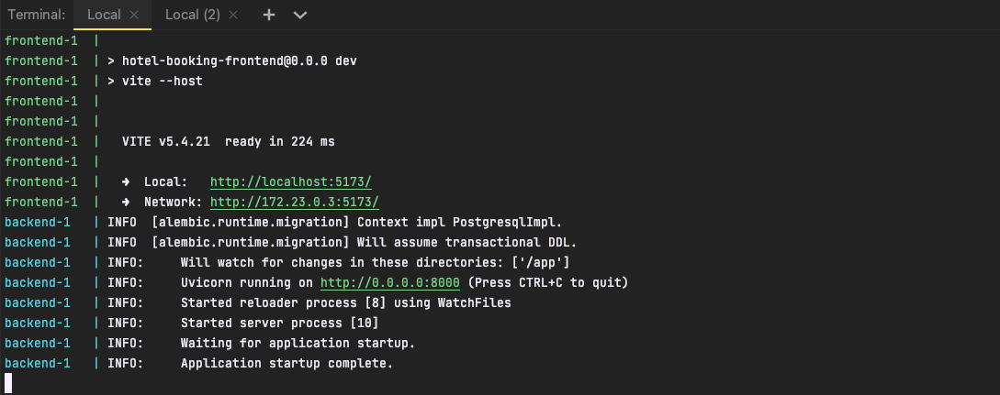
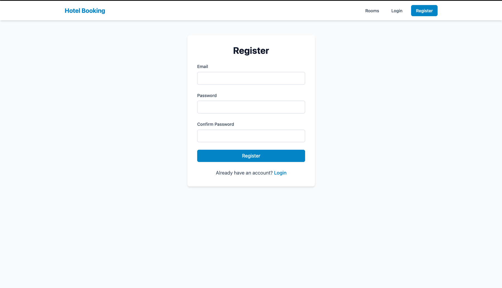
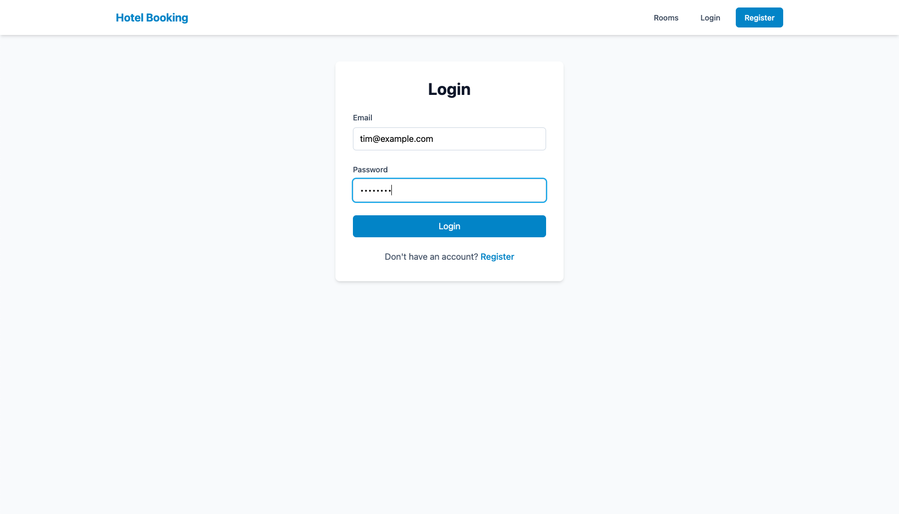
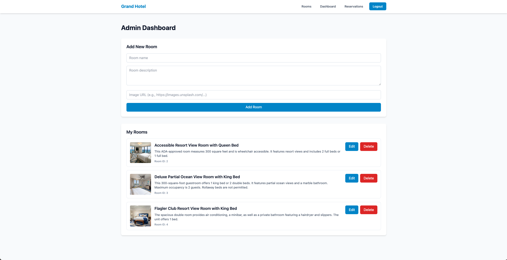
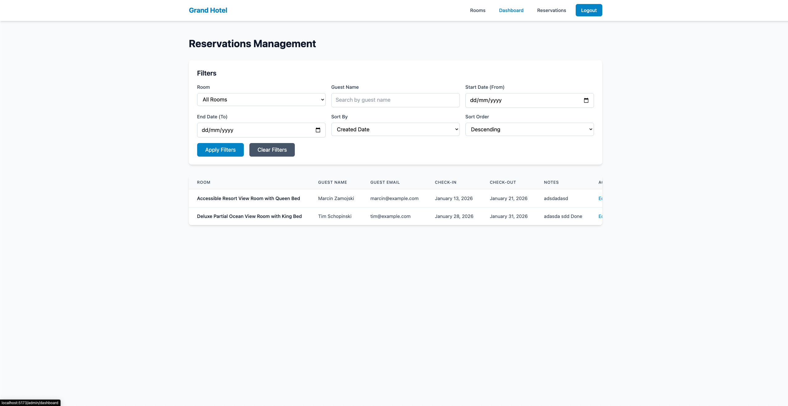
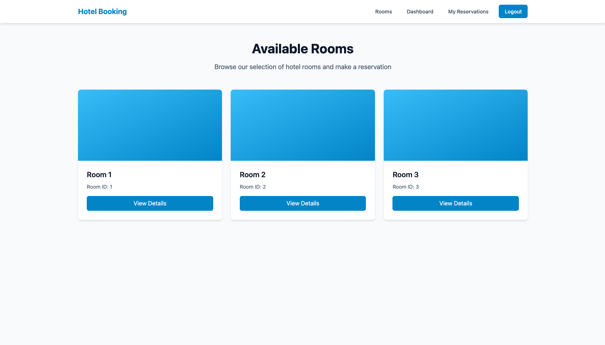
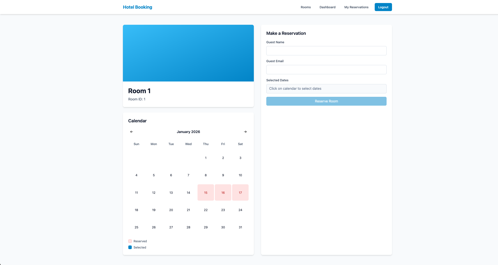

# HOTEL MANAGEMENT SYSTEM

A simple hotel room reservation system focused on frontend functionality.
This project was created as a university application project.

----------------------------------------------------
ABOUT THE PROJECT
----------------------------------------------------

This application implements a calendar-based reservation system for hotel rooms.
The main goal of the project is to focus on frontend architecture, user experience
and reservation flow rather than complex backend business logic.

----------------------------------------------------
TECH STACK
----------------------------------------------------

Backend:
- Python FastAPI
- PostgreSQL
- SQLAlchemy
- Alembic (database migrations)

Frontend:
- Vue 3
- TypeScript
- Tailwind CSS
- Pinia

----------------------------------------------------
RUN LOCALLY
----------------------------------------------------

To run the project locally:

1. Make sure Docker and Docker Compose are installed
2. Run:

   docker compose up

3. Open in browser:

   http://localhost:5173/

----------------------------------------------------
DEMO FEATURES
----------------------------------------------------

1. Hotel owner registration

2. User login (JWT authentication)

3. Creating hotel rooms

4. Viewing reservations

5. Public room listing for customers

6. Room details page with availability calendar

